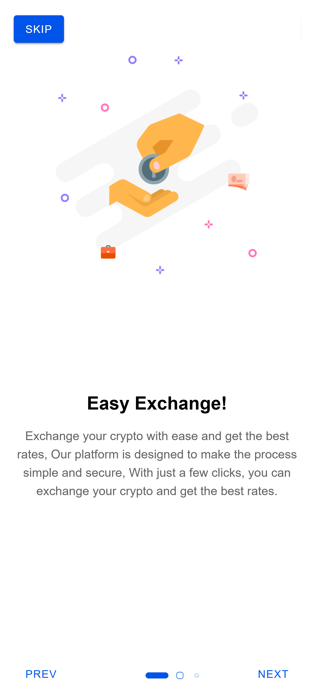
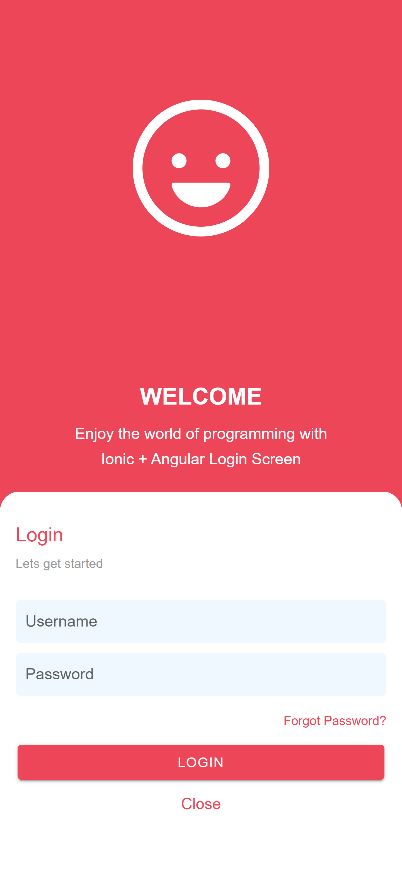

# UI Design Using Ionic and Angular

A curated collection of **multi-practice UI templates and mobile app screens** built with [Ionic Framework](https://ionicframework.com/) and [Angular](https://angular.io/). This repository is perfect for developers, designers, and learners who want to explore, reuse, or get inspired by a variety of modern mobile UI patterns—including login pages, onboarding flows, home screens, e-commerce templates, and more.

---

## 📢 Table of Contents

- [Overview](#overview)
- [Features](#features)
- [Diverse UI Templates Included](#divers_ui_templates_included)
- [Tech Stack](#tech_stack)
- [Project Structure](#project-structure)
- [Getting Started](#getting-started)
- [Usage](#usage)
- [Screenshots](#screenshots)
- [Project Screenshots Showcase](#project-screenshots-showcase)
- [Contributing](#contributing)
- [License](#license)

---

## 🧐 Overview

This repository contains **multiple standalone Ionic + Angular projects**, each demonstrating a specific UI pattern or app screen. Whether you need a stylish login page, a modern onboarding flow, or a ready-made e-commerce template, you’ll find reusable code examples here to accelerate your next mobile app project.

[⬆ back to top](#ui-design-using-ionic-and-angular)

---

## 🌟 Features

- **Multiple UI Examples:** Each folder is a separate mini-project focused on a specific UI (e.g., login, onboarding, home, e-commerce, etc.).
- **Modern Ionic Components:** Built with the latest Ionic UI elements for native-like performance and appearance.
- **Angular Integration:** All projects use Angular for structure, logic, and scalability.
- **Ready to Run:** Each example is self-contained and can be run independently.
- **Great for Learning:** Ideal for beginners and professionals looking to learn or prototype quickly.

[⬆ back to top](#ui-design-using-ionic-and-angular)

---

## 🎨 Diverse UI Templates Included
| Category | Examples (Based on folder names) |
| :--- | :--- |
| **Login & Auth Screens** | Basic Welcome Login, Business Welcome Login, Flat Purple Welcome Login, Modal Welcome Login, Dating App Login, etc. |
| **Onboarding Flows** | Dedicated onboarding screens UI with sliders (`17-onboarding-slides-screen-mobile-app`). |
| **E-commerce & Retail** | E-commerce Organic Food Template (`23-add-ecommerce-organic-food-home-page`), Car Selling/Rental UI (`04-car-selling-mobile-app`, `16-add-car-rental-home-page`). |
| **Food & Service Apps** | Swiggy Ordering Food Mobile App (`05-swiggy-ordering-food-mobile-app`), Food Ordering Home Page Screen (`15-food-entering-home-page-mobile-app`). |
| **Specialized Apps** | Gym Management UI (`02-gym-management-mobile-app`), Job Finder App UI (`03-job-finder-mobile-app`), Covid Home Page UI (`12-covid-home-page-screen-mobile-app`), Events Home Page UI (`22-add-events-home-page-mobile-app`). |
| **Utility Screens** | Home screens, detail views, list views, and settings pages for various app concepts. |

[⬆ back to top](#ui-design-using-ionic-and-angular)

---

# 🛠️ Tech Stack
The project is built using the following core technologies:

* **Framework:** **Ionic Framework** (used for native-like mobile and web styling and components).
* **Front-end:** **Angular** (the primary JavaScript framework).
* **Language:** **TypeScript** (for type safety and robust development).
* **Styling:** **SCSS** (used for advanced, modular styling).

[⬆ back to top](#ui-design-using-ionic-and-angular)

---

## 📁 Project Structure
```
ui-design-using-ionic-and-angular/
│
├── 01-first-angular-ionic-app/
├── 02-gym-management-mobile-app/
├── 03-pet-finder-mobile-app/
├── 04-car-selling-mobile-app/
├── ...
├── 33-bakery-dark-light-home-screens-mobile-app/
├── screenshots/
└── README.md
```

- Each numbered folder: A standalone Ionic + Angular UI example.
- screenshots/: Images of the UI examples for quick reference.

[⬆ back to top](#ui-design-using-ionic-and-angular)

---

## 🚀 Getting Started

**Prerequisites:**
- [Node.js](https://nodejs.org/) (v20+ recommended)
- [npm](https://www.npmjs.com/) or [yarn](https://yarnpkg.com/)
- [Ionic CLI](https://ionicframework.com/docs/cli):  

```bash
npm install -g @ionic/cli
```

**To run an example:**
1. **Navigate to the desired UI example folder:**
```bash
cd 04-car-selling-mobile-app
```

2. **Install dependencies:**
```bash
npm install
```

3. **Start the development server:**
```bash
ionic serve
```

>The app will open in your browser at http://localhost:8100.

Repeat these steps for any other UI example folder you wish to explore.

4. **View the different UIs:** 

The project is structured with multiple examples. Refer to the application's routing file (**app-routing.module.ts**) after running ionic serve to find the correct routes to access the different UI components and application examples (**e.g., /gym-management, /job-finder**).

[⬆ back to top](#ui-design-using-ionic-and-angular)

---

## 💻 Usage
- **Browse the folders** to find the UI pattern you need.
- **Copy code or components** into your own Ionic + Angular projects.
- **Customize styles and logic** as needed for your use case.

[⬆ back to top](#ui-design-using-ionic-and-angular)

---

## 🖼️ Screenshots
Find preview images for each UI example in the **screenshots/** directory.

[⬆ back to top](#ui-design-using-ionic-and-angular)

---

## 📸 Project Screenshots Showcase

| UI Example 1 | UI Example 2 | UI Example 3 |
| :---: | :---: | :---: |
| **01. First App** <br>  | **02. Gym Management UI (Screen 1)** <br>  | **02. Gym Management UI (Screen 2)** <br>  |
| **03. Job Finder UI** <br>  | **04. Car Selling UI** <br>  | **05. Swiggy UI Home Screens (Screen 1)** <br>  |
| **05. Swiggy UI Home Screens (Screen 2)** <br>  | **05. Swiggy UI Home Screens (Screen 3)** <br>  | **05. Swiggy UI Home Screens (Screen 4)** <br>  |
| **05. Swiggy UI Home Screens (Screen 5)** <br>  | **05. Swiggy UI Home Screens (Screen 6)** <br>  | **05. Swiggy UI Home Screens (Screen 7)** <br>  |
| **05. Swiggy UI Home Screens (Screen 8)** <br>  | **05. Swiggy UI Home Screens (Screen 9)** <br>  | **06. Welcome/Login UI (Screen 1)** <br>  |
| **06. Welcome/Login UI (Screen 2)** <br>  | **07. Purple Welcome UI (Screen 1)** <br>  | **07. Purple Welcome UI (Screen 2)** <br>  |
| **08. Business Welcome UI (Screen 1)** <br>  | **08. Business Welcome UI (Screen 2)** <br>  | **09. E-learning Welcome UI (Screen 1)** <br>  |
| **09. E-learning Welcome UI (Screen 2)** <br>  | **10. Fashionista Welcome UI (Screen 1)** <br>  | **10. Fashionista Welcome UI (Screen 2)** <br>  |
| **11. Tour Listing Home Page** <br>  | **12. COVID Home Page** <br>  | **13. Flat Purple Login (Screen 1)** <br>  |
| **13. Flat Purple Login (Screen 2)** <br>  | **14. Dating Home Page (Screen 1)** <br>  | **14. Dating Home Page (Screen 2)** <br>  |
| **15. Food Ordering Home (Screen 1)** <br>  | **15. Food Ordering Home (Screen 2)** <br>  | **16. Car Rental Home (Screen 1)** <br>  |
| **16. Car Rental Home (Screen 2)** <br>  | **17. Onboarding Slides (Screen 1)** <br>  | **17. Onboarding Slides (Screen 2)** <br>  |
| **17. Onboarding Slides (Screen 3)** <br>  | **18. Modal Welcome (Screen 1)** <br>  | **18. Modal Welcome (Screen 2)** <br>  |
| **18. Modal Welcome (Screen 3)** <br>  | **19. Center-Card Welcome (Screen 1)** <br>  | **19. Center-Card Welcome (Screen 2)** <br>  |
| **19. Center-Card Welcome (Screen 3)** <br>  | **19. Center-Card Welcome (Screen 4)** <br>  | **20. Modern Building Menu** <br>  |
| **21. Ecommerce Welcome (Screen 1)** <br>  | **21. Ecommerce Welcome (Screen 2)** <br>  | **21. Ecommerce Welcome (Screen 3)** <br>  |
| **21. Ecommerce Welcome (Screen 4)** <br>  | **21. Ecommerce Welcome (Screen 5)** <br>  | **21. Ecommerce Welcome (Screen 6)** <br>  |
| **21. Ecommerce Welcome (Screen 7)** <br>  | **21. Ecommerce Welcome (Screen 8)** <br>  | **21. Ecommerce Welcome (Screen 9)** <br>  |
| **21. Ecommerce Welcome (Screen 10)** <br>  | **21. Ecommerce Welcome (Screen 11)** <br>  | **22. Events Home Page** <br>  |
| **23. Organic Food Home (Screen 1)** <br>  | **23. Organic Food Home (GIF)** <br>  | **23. Organic Food Home (Screen 3)** <br>  |
| **23. Organic Food Home (Screen 4)** <br>  | **23. Organic Food Home (Screen 5)** <br>  | **24. Ecommerce Login/OTP (Screen 1)** <br>  |
| **24. Ecommerce Login/OTP (Screen 2)** <br>  | **24. Ecommerce Login/OTP (Screen 3)** <br>  | **24. Ecommerce Login/OTP (Screen 4)** <br>  |
| **25. Blood Donor Home (Screen 1)** <br>  | **25. Blood Donor Home (Screen 2)** <br>  | **25. Blood Donor Home (Screen 3)** <br>  |
| **25. Blood Donor Home (Screen 4)** <br>  | **25. Blood Donor Home (Screen 5)** <br>  | **26. Instagram Clone Home (Screen 1)** <br>  |
| **26. Instagram Clone Home (Screen 2)** <br>  | **26. Instagram Clone Home (Screen 3)** <br>  | **26. Instagram Clone Home (Screen 4 Custom tabs-01)** <br>  |
| **26. Instagram Clone Home (Screen 5 Custom tabs-02)** <br>  | **26. Instagram Clone Home (Screen 6 Custom tabs-03)** <br>  | **27. Travel Tour Home (Screen 1)** <br>  |
| **27. Travel Tour Home (GIF)** <br>  | **27. Travel Tour Home (Screen 2)** <br>  | **27. Travel Tour Home (Screen 3)** <br>  |
| **27. Travel Tour Home (Screen 4)** <br>  | **27. Travel Tour Home (Screen 5)** <br>  | **27. Travel Tour Home (Screen 6)** <br>  |
| **28. Dynamic Error Screens (Screen 1)** <br>  | **28. Dynamic Error Screens (GIF)** <br>  | **29. Wallet Finance Screens (Screen 1)** <br>  |
| **29. Wallet Finance Screens (Screen 2)** <br>  | **29. Wallet Finance Screens (Screen 3)** <br>  | **29. Wallet Finance Screens (Screen 4)** <br>  |
| **30. Food Delivery Screens (Screen 1)** <br>  | **30. Food Delivery Screens (Screen 2)** <br>  | **30. Food Delivery Screens (Screen 3)** <br>  |
| **30. Food Delivery Screens (Screen 4)** <br>  | **30. Food Delivery Screens (Screen 5)** <br>  | **31. Gift Store Home Screens (Screen 1)** <br>  |
| **31. Gift Store Home Screens (Screen 2)** <br>  | **31. Gift Store Home Screens (Screen 3)** <br>  | **31. Gift Store Home Screens (Screen 4)** <br>  |
| **31. Gift Store Home Screens (Screen 5)** <br>  | **31. Gift Store Home Screens (Screen 6)** <br>  | **31. Gift Store Home Screens (Screen 7)** <br>  |
| **31. Gift Store Home Screens (Screen 8)** <br>  | **31. Gift Store Home Screens (Screen 9)** <br>  | **31. Gift Store Home Screens (Screen 10)** <br>  |
| **31. Gift Store Home Screens (Screen 11)** <br>  | **31. Gift Store Home Screens (Screen 12)** <br>  | **31. Gift Store Home Screens (Screen 13)** <br>  |
| **31. Gift Store Home Screens (Screen 14)** <br>  | **32. Events Hub Home Screens (Screen 1)** <br>  | **32. Events Hub Home Screens (Screen 2)** <br>  |
| **32. Events Hub Home Screens (Screen 3)** <br>  | **32. Events Hub Home Screens (Screen 4)** <br>  | **32. Events Hub Home Screens (Screen 5)** <br>  |
| **33. Bakery Home Screens (Screen 1)** <br>  | **33. Bakery Home Screens (Screen 2)** <br>  | **33. Bakery Home Screens (Screen 3)** <br>  |
| **33. Bakery Home Screens (Screen 4)** <br>  | **33. Bakery Home Screens (Screen 5)** <br>  | **33. Bakery Home Screens (Screen 6)** <br>  |
| Coming Soon 👌 | Coming Soon 👌 | Coming Soon 👌 |

[⬆ back to top](#ui-design-using-ionic-and-angular)

---

## 🤝 Contributing
Contributions are welcome! Feel free to submit new UI examples, improve existing ones, or suggest ideas by opening an issue or pull request.

[⬆ back to top](#ui-design-using-ionic-and-angular)

---

## 📜 License
This project is licensed under the MIT License.

[⬆ back to top](#ui-design-using-ionic-and-angular)

---

## 👓 Explore. Learn. Build.
Accelerate your mobile app development with ready-made Ionic + Angular UI templates!

> Let me know if you want to include example screenshots, badges, or further customization!

[⬆ back to top](#ui-design-using-ionic-and-angular)

## 🧑‍💻 Author

**Ouakala Abdelaaziz**  
Founder — Programming Mastery Academy Pvt. Ltd. 

📺 [YouTube: Apps Presentation](https://www.youtube.com/@LegendDZ)

📺 [YouTube: Main Channel](https://www.youtube.com/@ProgrammingMasteryAcademy)

🌐 [Website: O.Abdelaaziz](https://ouakala-abdelaaziz.epizy.com/)

🌐 [Linkedin: O.Abdelaaziz](https://dz.linkedin.com/in/abdelaaziz-ouakala)

---

## 🪪 License

This project is licensed under the **MIT License**.  
You are free to use, modify, and distribute it for learning and educational purposes.

---

⭐ **If this project helped you, consider giving it a star!**

